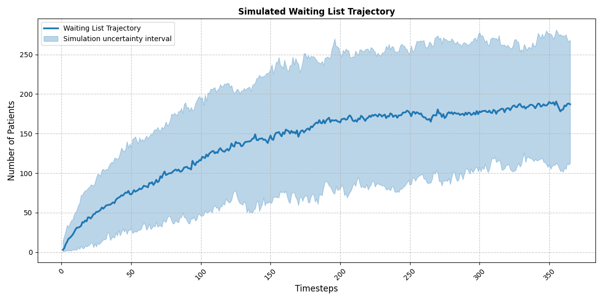

# waiting-list-simulation
Simple simulation tool for outpatient clinics, following simple FIFO queuing dynamics. The outputs allow you to estimate the impact on patient waiting times and queue length by altering a number of key paramters, including:
* Number of available slots (service capacity)
* Number of referrals into the service (service demand)
* DNA or cancellation rates (a proportion of DNA slots get re-booked)

 ## Installation

To install the necessary dependencies, run:

```bash
pip install -r requirements.txt
```

## Simple usage

```python
from simulation_model import Patient, run_simulations

# Run waiting list simulation
results = run_simulations(
    num_simulations=100,
    time_steps=365,
    initial_queue=None, # Assume no initial waiting list
    capacity=[50] * 365, # Assuming constant capacity over trajectory
    mean_arr=50 # Arrivals follow Poisson process
)
```
## Example Plot

Below is an example plot showing the waiting time over time for multiple simulations.



See the example notebook for a more detailed explanation of simulation.
